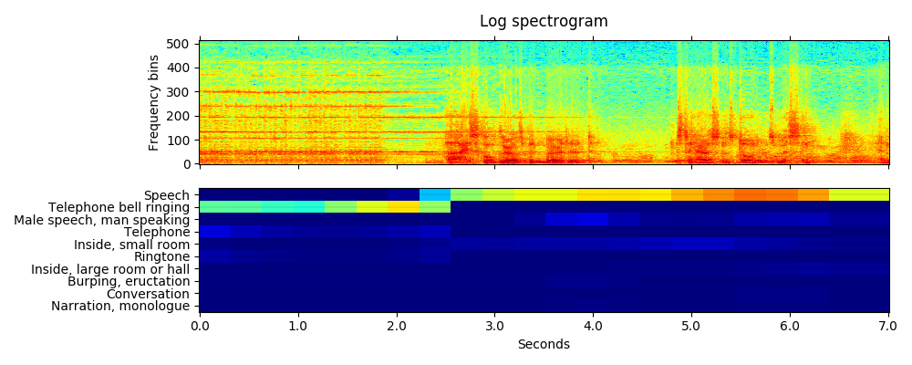
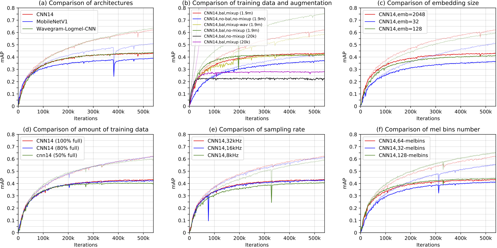

# PANNs: Large-Scale Pretrained Audio Neural Networks for Audio Pattern Recognition

This repo contains code for our paper: **PANNs: Large-Scale Pretrained Audio Neural Networks for Audio Pattern Recognition** [1]. A variety of CNNs are trained on the large-scale AudioSet dataset [2] containing 5000 hours audio with 527 sound classes. A mean average precision (mAP) of 0.439 is achieved using our proposed Wavegram-Logmel-CNN system, outperforming the Google baseline of 0.317 [3]. The PANNs have been used for audio tagging and sound event detection. The PANNs have been used to fine-tune several audio pattern recoginition tasks, and have outperformed several state-of-the-art systems. 

## Environments
The codebase is developed with Python 3.7. Install requirements as follows:
```
pip install -r requirements.txt
```

## Audio tagging using pretrained models
Users can inference the tags of an audio recording using pretrained models without training. First, downloaded one pretrained model from https://zenodo.org/record/3960586, for example, the model named "Cnn14_mAP=0.431.pth". Then, execute the following commands to inference this [audio](resources/R9_ZSCveAHg_7s.wav):
```
MODEL_TYPE="Cnn14"
CHECKPOINT_PATH="Cnn14_mAP=0.431.pth"
CUDA_VISIBLE_DEVICES=0 python3 pytorch/inference.py audio_tagging --model_type=$MODEL_TYPE --checkpoint_path=$CHECKPOINT_PATH --audio_path="resources/R9_ZSCveAHg_7s.wav" --cuda
```

Then the result will be printed on the screen looks like:
```
Speech: 0.893
Telephone bell ringing: 0.754
Inside, small room: 0.235
Telephone: 0.183
Music: 0.092
Ringtone: 0.047
Inside, large room or hall: 0.028
Alarm: 0.014
Animal: 0.009
Vehicle: 0.008
embedding: (2048,)
```

## Sound event detection using pretrained models
Users can inference the tags of an audio recording using pretrained models without training. First, downloaded one pretrained model from https://zenodo.org/record/3960586, for example, the model named "Cnn14_DecisionLevelMax_mAP=0.385.pth". Then, execute the following commands to inference this [audio](resources/R9_ZSCveAHg_7s.wav):
```
MODEL_TYPE="Cnn14_DecisionLevelMax"
CHECKPOINT_PATH="Cnn14_DecisionLevelMax_mAP=0.385.pth"
CUDA_VISIBLE_DEVICES=0 python3 pytorch/inference.py sound_event_detection --model_type=$MODEL_TYPE --checkpoint_path=$CHECKPOINT_PATH --audio_path="resources/R9_ZSCveAHg_7s.wav" --cuda
```

The visualization of sound event detection result looks like:


Please see https://www.youtube.com/watch?v=QyFNIhRxFrY for a sound event detection demo.

For those users who only want to use the pretrained models for inference, we have prepared a **panns_inference** tool which can be easily installed by:
```
pip install panns_inference
```

Please visit https://github.com/qiuqiangkong/panns_inference for details of panns_inference.

## Train PANNs from scrratch
Users can train PANNs from scratch by executing the commands in runme.sh. The runme.sh consists of three parts. 1. Download the full dataset. 2. Pack downloaded wavs to hdf5 file to speed up loading. 3. Train PANNs. 

## 1. Download dataset
The runme.sh script can be used to download all AudioSet data from YouTube. The total data is around 1.1 TB. Notice there can be missing files on YouTube, so the numebr of files downloaded by users can be different from time to time. Our downloaded version contains 20550 / 22160 of the balaned training subset, 1913637 / 2041789 of the unbalanced training subset, and 18887 / 20371 of the evaluation subset. The downloaded data looks like:
<pre>

dataset_root
├── audios
│    ├── balanced_train_segments
│    |    └── ... (~20550 wavs, the number can be different from time to time)
│    ├── eval_segments
│    |    └── ... (~18887 wavs)
│    └── unbalanced_train_segments
│         ├── unbalanced_train_segments_part00
│         |    └── ... (~46940 wavs)
│         ...
│         └── unbalanced_train_segments_part40
│              └── ... (~39137 wavs)
└── metadata
     ├── balanced_train_segments.csv
     ├── class_labels_indices.csv
     ├── eval_segments.csv
     ├── qa_true_counts.csv
     └── unbalanced_train_segments.csv
</pre>

## 2. Pack data to hdf5
Loading wav format files is slow, and storing millions of files on disk is inefficient. To speed up training, we pack 2 million wavs to 43 hdf5 files: one for balanced training subset, one for evaluation subset and 41 for unbalanced traning subset. The packed files looks like:

<pre>
workspace
└── hdf5s
     ├── targets (2.3 GB)
     |    ├── balanced_train.h5
     |    ├── eval.h5
     |    └── unbalanced_train
     |        ├── unbalanced_train_part00.h5
     |        ...
     |        └── unbalanced_train_part40.h5
     └── waveforms (1.1 TB)
          ├── balanced_train.h5
          ├── eval.h5
          └── unbalanced_train
              ├── unbalanced_train_part00.h5
              ...
              └── unbalanced_train_part40.h5
</pre>

## 3. Train
Training is easy!

```
WORKSPACE="your_workspace"
CUDA_VISIBLE_DEVICES=0 python3 pytorch/main.py train --workspace=$WORKSPACE --data_type='full_train' --window_size=1024 --hop_size=320 --mel_bins=64 --fmin=50 --fmax=14000 --model_type='Cnn13_specaug' --loss_type='clip_bce' --balanced='balanced' --augmentation='mixup' --batch_size=32 --learning_rate=1e-3 --resume_iteration=0 --early_stop=1000000 --cuda
```

## Results
The CNN models are trained on a single card Tesla-V100-PCIE-32GB. (The training also works on a GPU card with 12 GB). The training takes around 3 - 7 days. 

```
Validate bal mAP: 0.005
Validate test mAP: 0.005
    Dump statistics to /workspaces/pub_audioset_tagging_cnn_transfer/statistics/main/sample_rate=32000,window_size=1024,hop_size=320,mel_bins=64,fmin=50,fmax=14000/data_type=full_train/Cnn13/loss_type=clip_bce/balanced=balanced/augmentation=mixup/batch_size=32/statistics.pkl
    Dump statistics to /workspaces/pub_audioset_tagging_cnn_transfer/statistics/main/sample_rate=32000,window_size=1024,hop_size=320,mel_bins=64,fmin=50,fmax=14000/data_type=full_train/Cnn13/loss_type=clip_bce/balanced=balanced/augmentation=mixup/batch_size=32/statistics_2019-09-21_04-05-05.pickle
iteration: 0, train time: 8.261 s, validate time: 219.705 s
------------------------------------
...
------------------------------------
Validate bal mAP: 0.637
Validate test mAP: 0.431
    Dump statistics to /workspaces/pub_audioset_tagging_cnn_transfer/statistics/main/sample_rate=32000,window_size=1024,hop_size=320,mel_bins=64,fmin=50,fmax=14000/data_type=full_train/Cnn13/loss_type=clip_bce/balanced=balanced/augmentation=mixup/batch_size=32/statistics.pkl
    Dump statistics to /workspaces/pub_audioset_tagging_cnn_transfer/statistics/main/sample_rate=32000,window_size=1024,hop_size=320,mel_bins=64,fmin=50,fmax=14000/data_type=full_train/Cnn13/loss_type=clip_bce/balanced=balanced/augmentation=mixup/batch_size=32/statistics_2019-09-21_04-05-05.pickle
iteration: 600000, train time: 3253.091 s, validate time: 1110.805 s
------------------------------------
Model saved to /workspaces/pub_audioset_tagging_cnn_transfer/checkpoints/main/sample_rate=32000,window_size=1024,hop_size=320,mel_bins=64,fmin=50,fmax=14000/data_type=full_train/Cnn13/loss_type=clip_bce/balanced=balanced/augmentation=mixup/batch_size=32/600000_iterations.pth
...
```

An **mean average precision (mAP)** of **0.431** is obtained. The training curve looks like:



Results of PANNs on AudioSet tagging. Dash and solid lines are training mAP and evaluation mAP, respectively. The six plots show the results with different: (a) architectures; (b) data balancing and data augmentation; (c) embedding size; (d) amount of training data; (e) sampling rate; (f) number of mel bins.

## Performance of differernt systems


Top rows show the previously proposed methods using embedding features provided by Google. Previous best system achieved an mAP of 0.369 using large feature-attention neural networks. We propose to train neural networks directly from audio recordings. Our CNN14 achieves an mAP of 0.431, and Wavegram-Logmel-CNN achieves an mAP of 0.439.  


## Fine-tune on new tasks
After downloading the pretrained models. Build fine-tuned systems for new tasks is simple!

```
MODEL_TYPE="Transfer_Cnn14"
CHECKPOINT_PATH="Cnn14_mAP=0.431.pth"
CUDA_VISIBLE_DEVICES=0 python3 pytorch/finetune_template.py train --window_size=1024 --hop_size=320 --mel_bins=64 --fmin=50 --fmax=14000 --model_type=$MODEL_TYPE --pretrained_checkpoint_path=$CHECKPOINT_PATH --cuda
```

Here is an example of fine-tuning PANNs to GTZAN music classification: https://github.com/qiuqiangkong/panns_transfer_to_gtzan

## Demos
We apply the audio tagging system to build a sound event detection (SED) system. The SED prediction is obtained by applying the audio tagging system on consecutive 2-second segments. The video of demo can be viewed at: <br>
https://www.youtube.com/watch?v=7TEtDMzdLeY

## FAQs
If users came across out of memory error, then try to reduce the batch size.

## Cite
[1] Qiuqiang Kong, Yin Cao, Turab Iqbal, Yuxuan Wang, Wenwu Wang, Mark D. Plumbley. "PANNs: Large-Scale Pretrained Audio Neural Networks for Audio Pattern Recognition." arXiv preprint arXiv:1912.10211 (2019).

## Reference
[2] Gemmeke, J.F., Ellis, D.P., Freedman, D., Jansen, A., Lawrence, W., Moore, R.C., Plakal, M. and Ritter, M., 2017, March. Audio set: An ontology and human-labeled dataset for audio events. In IEEE International Conference on Acoustics, Speech and Signal Processing (ICASSP), pp. 776-780, 2017

[3] Hershey, S., Chaudhuri, S., Ellis, D.P., Gemmeke, J.F., Jansen, A., Moore, R.C., Plakal, M., Platt, D., Saurous, R.A., Seybold, B. and Slaney, M., 2017, March. CNN architectures for large-scale audio classification. In 2017 IEEE International Conference on Acoustics, Speech and Signal Processing (ICASSP), pp. 131-135, 2017

## External links
Other work on music transfer learning includes: <br>
https://github.com/jordipons/sklearn-audio-transfer-learning <br>
https://github.com/keunwoochoi/transfer_learning_music

