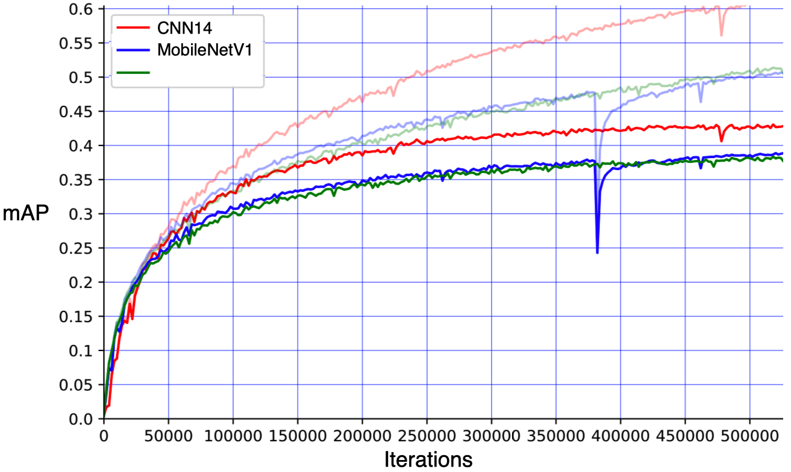
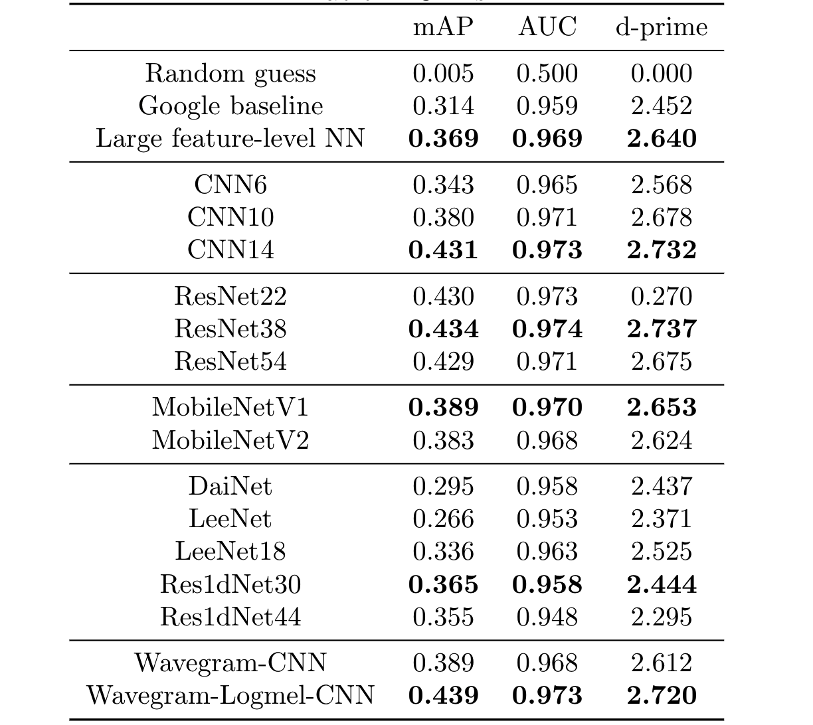

# AudioSet tagging with convolutional neural network (CNN) trained from scratch

AudioSet is a large scale audio dataset containing 2 million 10-second audio clips with an ontology of 527 sound classes. The status of AudioSet is similar to ImageNet in computer vision. This codebase provides training a variety of CNNs on AudioSet from scratch. 

## Run
./runme.sh

The runme.sh consists of three parts. 1. Download the full dataset. 2. Pack downloaded wavs to hdf5 file to speed up loading. 3. Train CNN models. 

## 1. Download dataset
Users need to download the AudioSet. The runme.sh script can be used to download all data from YouTube. The total data is around 1.1 TB. Notice there can be missing files on YouTube so the numebr of files downloaded by users can be different from time to time. Our downloaded version contains 22050 / 22160 of balaned training subset, ~1.7m / 2041789 of unbalanced training subset and 18887 / 20371 evaluation subset. The downloaded data looks like:
<pre>

dataset_root
├── audios
│    ├── balanced_train_segments
│    |    └── ... (~20550 wavs, the number can be different from time to time)
│    ├── eval_segments
│    |    └── ... (~18887 wavs)
│    └── unbalanced_train_segments
│         ├── unbalanced_train_segments_part00
│         |    └── ... (~46940 wavs)
│         ...
│         └── unbalanced_train_segments_part40
│              └── ... (~39137 wavs)
└── metadata
     ├── balanced_train_segments.csv
     ├── class_labels_indices.csv
     ├── eval_segments.csv
     ├── qa_true_counts.csv
     └── unbalanced_train_segments.csv
</pre>

## 2. Pack data to hdf5
Loading wav format files is slow. Also storing millions of files on disk is inefficient. We pack wavs to big hdf5 files, 1 for balanced training subset, 1 for evaluation subset and 41 for unbalanced traning subset. The packed files looks like:

<pre>
workspace
└── hdf5s
     ├── targets (2.3 GB)
     |    ├── balanced_train.h5
     |    ├── eval.h5
     |    └── unbalanced_train
     |        ├── unbalanced_train_part00.h5
     |        ...
     |        └── unbalanced_train_part40.h5
     └── waveforms (1.1 TB)
          ├── balanced_train.h5
          ├── eval.h5
          └── unbalanced_train
              ├── unbalanced_train_part00.h5
              ...
              └── unbalanced_train_part40.h5
</pre>

## 3. Train
Training is easy!

```
WORKSPACE="your_workspace"
CUDA_VISIBLE_DEVICES=0 python3 pytorch/main.py train --workspace=$WORKSPACE --data_type='full_train' --window_size=1024 --hop_size=320 --mel_bins=64 --fmin=50 --fmax=14000 --model_type='Cnn13_specaug' --loss_type='clip_bce' --balanced='balanced' --augmentation='mixup' --batch_size=32 --learning_rate=1e-3 --resume_iteration=0 --early_stop=1000000 --cuda
```

## Results
The CNN models are trained on a single card Tesla-V100-PCIE-32GB. (The training also works on a GPU card with 12 GB). The training takes around 3 - 7 days. 

```
Validate bal mAP: 0.005
Validate test mAP: 0.005
    Dump statistics to /workspaces/pub_audioset_tagging_cnn_transfer/statistics/main/sample_rate=32000,window_size=1024,hop_size=320,mel_bins=64,fmin=50,fmax=14000/data_type=full_train/Cnn13/loss_type=clip_bce/balanced=balanced/augmentation=mixup/batch_size=32/statistics.pkl
    Dump statistics to /workspaces/pub_audioset_tagging_cnn_transfer/statistics/main/sample_rate=32000,window_size=1024,hop_size=320,mel_bins=64,fmin=50,fmax=14000/data_type=full_train/Cnn13/loss_type=clip_bce/balanced=balanced/augmentation=mixup/batch_size=32/statistics_2019-09-21_04-05-05.pickle
iteration: 0, train time: 8.261 s, validate time: 219.705 s
------------------------------------
...
------------------------------------
Validate bal mAP: 0.637
Validate test mAP: 0.431
    Dump statistics to /workspaces/pub_audioset_tagging_cnn_transfer/statistics/main/sample_rate=32000,window_size=1024,hop_size=320,mel_bins=64,fmin=50,fmax=14000/data_type=full_train/Cnn13/loss_type=clip_bce/balanced=balanced/augmentation=mixup/batch_size=32/statistics.pkl
    Dump statistics to /workspaces/pub_audioset_tagging_cnn_transfer/statistics/main/sample_rate=32000,window_size=1024,hop_size=320,mel_bins=64,fmin=50,fmax=14000/data_type=full_train/Cnn13/loss_type=clip_bce/balanced=balanced/augmentation=mixup/batch_size=32/statistics_2019-09-21_04-05-05.pickle
iteration: 600000, train time: 3253.091 s, validate time: 1110.805 s
------------------------------------
Model saved to /workspaces/pub_audioset_tagging_cnn_transfer/checkpoints/main/sample_rate=32000,window_size=1024,hop_size=320,mel_bins=64,fmin=50,fmax=14000/data_type=full_train/Cnn13/loss_type=clip_bce/balanced=balanced/augmentation=mixup/batch_size=32/600000_iterations.pth
...
```

An mean average precision (mAP) of 0.431 is obtained. 

The training curve looks like:



## Performance of differernt systems



## Pretarined models are available
The pretrained models can be downloaded from https://zenodo.org/record/3576403

## Inference
After downloading the pretrained models. Inference labels of an audio clip is simple!

```
MODEL_TYPE="Cnn14"
CHECKPOINT_PATH="Cnn14_mAP=0.431.pth"
CUDA_VISIBLE_DEVICES=0 python3 pytorch/inference_template.py inference --window_size=1024 --hop_size=320 --mel_bins=64 --fmin=50 --fmax=14000 --model_type=$MODEL_TYPE --checkpoint_path=$CHECKPOINT_PATH --cuda
```

## Fine-tune on new tasks
After downloading the pretrained models. Build fine-tuned systems for new tasks is simple!

```
MODEL_TYPE="Transfer_Cnn14"
CHECKPOINT_PATH="Cnn14_mAP=0.431.pth"
CUDA_VISIBLE_DEVICES=1 python3 pytorch/finetune_template.py train --window_size=1024 --hop_size=320 --mel_bins=64 --fmin=50 --fmax=14000 --model_type=$MODEL_TYPE --pretrained_checkpoint_path=$CHECKPOINT_PATH --cuda
```

## Cite
[1] Kong, Qiuqiang, Changsong Yu, Yong Xu, Turab Iqbal, Wenwu Wang, and Mark D. Plumbley. "Weakly Labelled AudioSet Tagging With Attention Neural Networks." IEEE/ACM Transactions on Audio, Speech, and Language Processing 27, no. 11 (2019): 1791-1802.

## External links
Other work on music transfer learning includes:
https://github.com/jordipons/sklearn-audio-transfer-learning
https://github.com/keunwoochoi/transfer_learning_music